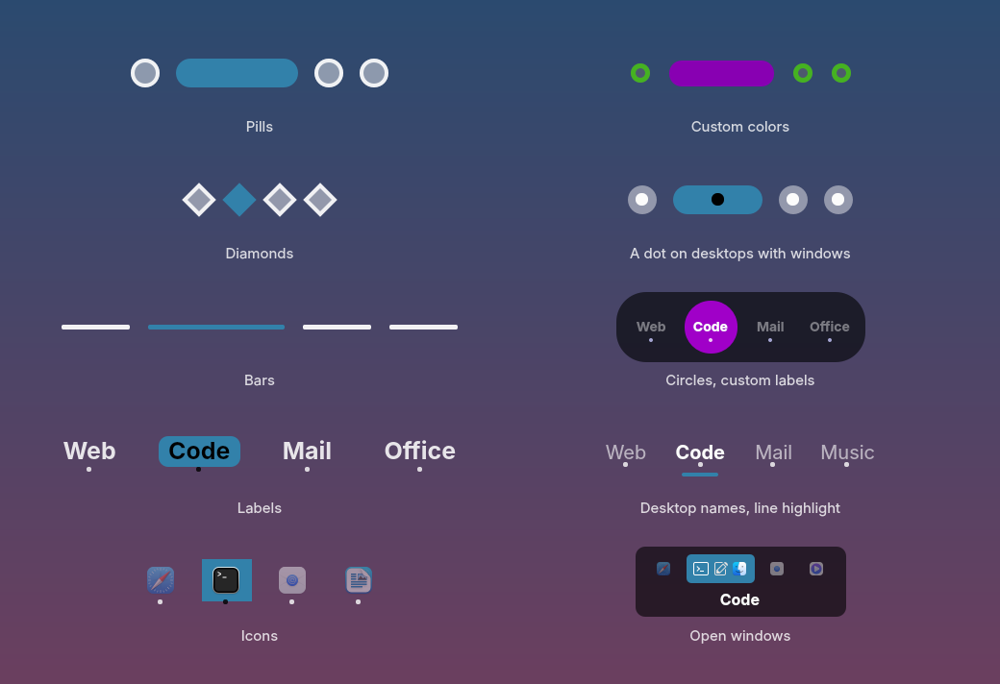

# OSD Desk Snake

An on-screen indicator for KDE Plasma 6 that shows up when you switch virtual
desktops, in the style of the [Kara](https://github.com/dhruv8sh/kara) pager.
The highlight slides from one desktop to the next with KWin's animation, and
follows your fingers during touchpad swipes.


The highlight slides as desktops change. Some of the styles:



- Styles: pills (pill, circle, square, diamond, bar), labels (number, desktop
  name, template, custom list), icons, open windows.
- Highlights: full, square, line, full with line; cells rounded, round or square.
- Marks the desktops that hold windows; follows the KWin desktop grid.
- Position: nine anchors with margin and offsets, or free position; drag it
  with the mouse while the settings app is open, with optional snapping.
- Timing: delay, fade in, display time, fade out, zoom effect, highlight
  motion (follow the switch or cross-fade once done), duration and curve.
- Plasma theme colors or custom ones, Plasma or custom background with opacity.
- Live settings app, and the usual page in System Settings.
- English and French.

It is a KWin script (pure QML) plus a small settings app (C++/QML, Kirigami).
Tested on Plasma 6.6 (Wayland).

## Install

OSD Desk Snake comes in two parts:

- the indicator, a KWin script. It is all you need, and it has its settings
  page in System Settings.
- OSD Desk Snake Settings, an optional app: every change shows on the real
  indicator right away, and the indicator can be dragged with the mouse.

### The indicator (KWin script)

Nothing to build. Download `osd-desk-snake-0.1.0.kwinscript` from the
[Releases](https://github.com/rcspam/osd-desk-snake/releases) page, then in
System Settings > Window Management > KWin Scripts, click Install from File…
and pick it. Or in a terminal:

```sh
kpackagetool6 --type KWin/Script --install osd-desk-snake-0.1.0.kwinscript   # --upgrade for a newer one
```

Tick OSD Desk Snake in the KWin Scripts list and click Apply. Turn off the
built-in OSD in System Settings > Virtual Desktops if it is on. The settings
button next to the script opens its settings page. The color fields of that
page need the KWidgetsAddons Designer plugin, missing on some systems
(`libkf6widgetsaddons-dev` on Debian and Ubuntu, `kf6-kwidgetsaddons-devel` on
Fedora).

To remove it: `kpackagetool6 --type KWin/Script --remove osd-desk-snake`.

### The settings app (optional)

#### Packages (amd64)

They hold the script and the app together, for all users:

```sh
sudo apt install ./osd-desk-snake_0.1.0_amd64.deb              # Debian, Ubuntu, KDE neon, Tuxedo OS
sudo dnf install ./osd-desk-snake-0.1.0-1.fc44.x86_64.rpm      # Fedora
sudo pacman -U ./osd-desk-snake-0.1.0-1-x86_64.pkg.tar.zst     # Arch, or makepkg -si in packaging/arch
```

Then enable the script as above. The .deb is built with Qt 6.10 and KDE
Frameworks 6.24 and needs those versions or newer (KDE neon, Tuxedo OS, recent
Kubuntu). On older systems, build from source. If you installed the
.kwinscript before, remove it first: the copy in your home folder would hide
the packaged one. The packages are made with `packaging/build-packages.sh`.

#### From source

Needs Qt 6.6 and KDE Frameworks 6 or newer (Debian 13 is fine).

1. Build tools and libraries, plus the QML modules the app uses at run time (a
   Plasma desktop usually has those already):

   ```sh
   # Debian, Ubuntu, KDE neon
   sudo apt install git cmake g++ extra-cmake-modules gettext qt6-base-dev qt6-declarative-dev \
       libkf6config-dev libkf6i18n-dev libkf6windowsystem-dev \
       qml6-module-org-kde-kirigami qml6-module-org-kde-desktop \
       qml6-module-qtquick-controls qml6-module-qtquick-dialogs qml6-module-qtquick-layouts
   # Fedora
   sudo dnf install git cmake gcc-c++ extra-cmake-modules gettext qt6-qtbase-devel qt6-qtdeclarative-devel \
       kf6-kconfig-devel kf6-ki18n-devel kf6-kwindowsystem-devel \
       kf6-kirigami kf6-qqc2-desktop-style
   # Arch
   sudo pacman -S --needed git base-devel cmake extra-cmake-modules gettext qt6-base qt6-declarative \
       kconfig ki18n kwindowsystem kirigami qqc2-desktop-style
   ```

2. Get the code:

   ```sh
   git clone https://github.com/rcspam/osd-desk-snake.git
   cd osd-desk-snake
   ```

3. Build and install, either for your user only (into `~/.local`, no root):

   ```sh
   ./install.sh app         # the settings app alone, next to the .kwinscript
   ./install.sh             # or the script and the app together, script loaded at once
   ./install.sh uninstall   # removes both
   ```

   `./install.sh` without `app` also uses kpackagetool6 and qdbus (packages
   `kpackagetool6 qdbus-qt6` on Debian and Ubuntu, `kf6-kpackage qt6-qttools`
   on Fedora, `kpackage qt6-tools` on Arch).

   Or for all users, like the packages:

   ```sh
   cmake -B build -DCMAKE_INSTALL_PREFIX=/usr -DBUILD_TESTING=OFF
   cmake --build build
   sudo cmake --install build
   ```

The settings app is in the application menu, and a link at the top of the
script settings page opens it.

## Configure

Two ways, same settings:

- OSD Desk Snake Settings, in the application menu (`osd-desk-snake-settings`):
  every change is saved and shown on the real indicator right away, while the
  indicator stays on screen. Revert goes back to the settings you had when the
  window opened. While it is open the indicator can also be dragged: in anchor
  mode it snaps to the nearest anchor (Snap to anchors), in free mode it keeps
  the exact spot.
- System Settings > Window Management > KWin Scripts > OSD Desk Snake > Configure:
  changes show up on Apply. A link at the top of that page opens the settings
  app when it is installed.

While the settings dialog is open, the indicator stays on screen and picks up
every Apply within a second. KWin does not reload script settings by itself, so
OSD Desk Snake asks it to: every second while the dialog is open, and about 0.7 s
after a desktop switch otherwise (at most every 3 s).

## Develop

```sh
./install.sh reload          # load the working copy into the running KWin
tests/run-tests.sh           # unit tests + PNG previews of every style in tests/preview-out
python3 tools/gen_config_ui.py   # regenerate config.ui, the app form model and schema.js
cmake -S settings-app -B settings-app/build && cmake --build settings-app/build
settings-app/build/bin/settingsstoretest
```

The settings app (C++/QML, Kirigami) reads the script schema `main.xml` at build
time and writes kwinrc through KConfigLoader, so defaults are never written.

To add a setting: declare it in `contents/config/main.xml` (type and default,
the only place defaults are written), add a typed property to
`contents/ui/Settings.qml`, add a row to the table in `tools/gen_config_ui.py`,
then run the generator. It writes `config.ui`, the settings app form model and
`contents/ui/schema.js`; `tests/tst_fields.qml` checks that everything matches.
Logs: `journalctl --user -b | grep -i osd-desk-snake`.
